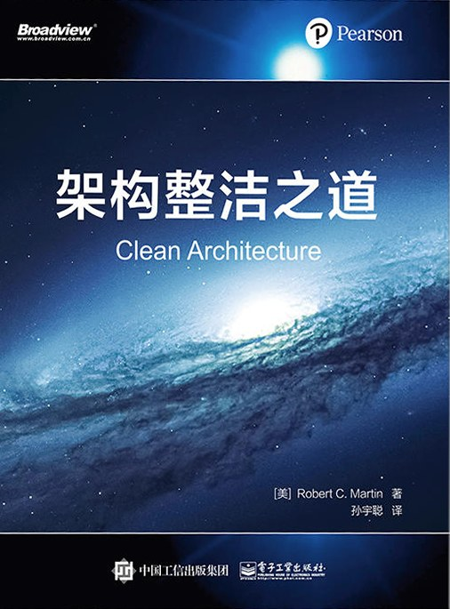

# BookReadingNotes-CleanArchitecture
《架构整洁之道》读书笔记

---
## 第1部分 概述
### [第1章 设计与架构究竟是什么](./docs/Part1.Chapter1.md)
### [第2章 两个价值维度](./docs/Part1.Chapter2.md)
---
## 第2部分 从基础构件开始：编程范式
### [第3章 编程范式总览](./docs/Part2.Chapter3.md)
### [第4章 结构化编程](./docs/Part2.Chapter4.md)
### [第5章 面向对象编程](./docs/Part2.Chapter5.md)
### [第6章 函数式编程](./docs/Part2.Chapter6.md)
---
## 第3部分 设计原则
### [第7章 SRP：单一职责原则](./docs/Part3.Chapter7.md)
### [第8章 OCP：开闭原则](./docs/Part3.Chapter8.md)
### [第9章 LSP：里氏替换原则](./docs/Part3.Chapter9.md)
### [第10章 ISP：接口隔离原则](./docs/Part3.Chapter10.md)
### [第11章 DIP：依赖反转原则](./docs/Part3.Chapter11.md)
---
## 第4部分 组件构建原则
### [第12章 组件](./docs/Part4.Chapter12.md)
### [第13章 组件聚合](./docs/Part4.Chapter13.md)
### [第14章 组件耦合](./docs/Part4.Chapter14.md)
---
## 第5部分 软件架构
### [第15章 什么是软件架构](./docs/Part5.Chapter15.md)
### [第16章 独立性](./docs/Part5.Chapter16.md)
### [第17章 划分边界](./docs/Part5.Chapter17.md)
### [第18章 边界剖析](./docs/Part5.Chapter18.md)
### [第19章 策略与层次](./docs/Part5.Chapter19.md)
### [第20章 业务逻辑](./docs/Part5.Chapter20.md)
### [第21章 尖叫的软件架构](./docs/Part5.Chapter21.md)
### [第22章 整洁架构](./docs/Part5.Chapter22.md)
### [第23章 展示器和谦卑对象](./docs/Part5.Chapter23.md)
### [第24章 不完全边界](./docs/Part5.Chapter24.md)
### [第25章 层次与边界](./docs/Part5.Chapter25.md)
### [第26章 Main组件](./docs/Part5.Chapter26.md)
### [第27章 服务：宏观与微观](./docs/Part5.Chapter27.md)
### [第28章 测试边界](./docs/Part5.Chapter28.md)
### [第29章 整洁的嵌入式架构](./docs/Part5.Chapter29.md)
---
## 第6部分 实现细节
### [第30章 数据库只是实现细节](./docs/Part6.Chapter30.md)
### [第31章 Web是实现细节](./docs/Part6.Chapter31.md)
### [第32章 应用程序框架是实现细节](./docs/Part6.Chapter33.md)
### [第33章 案例分析：视频销售网站](./docs/Part6.Chapter32.md)
### [第34章 拾遗](./docs/Part6.Chapter34.md)
